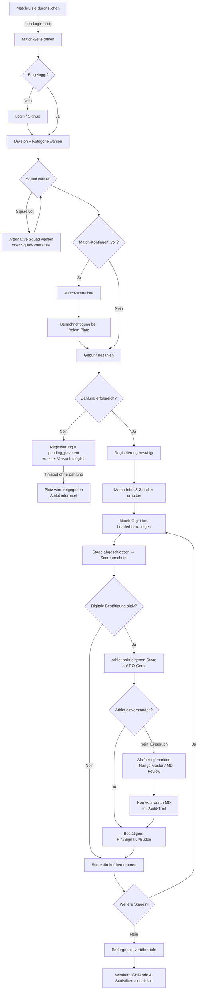
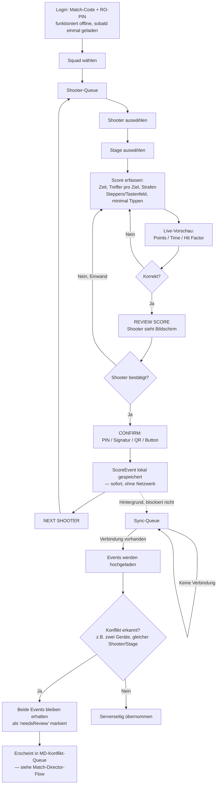
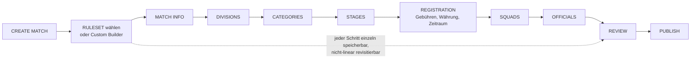
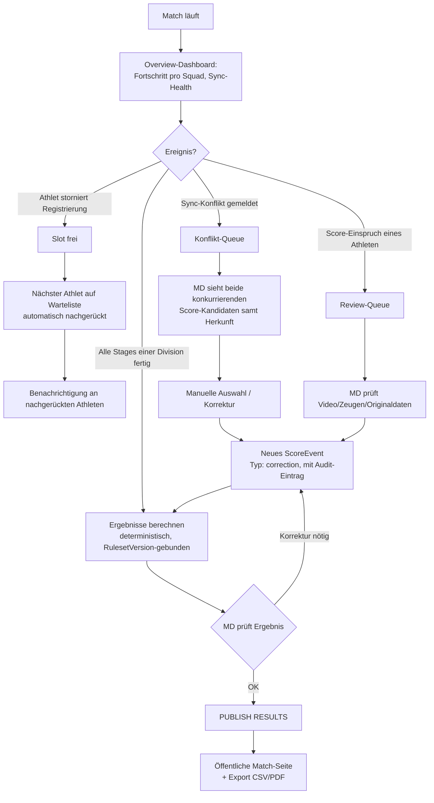
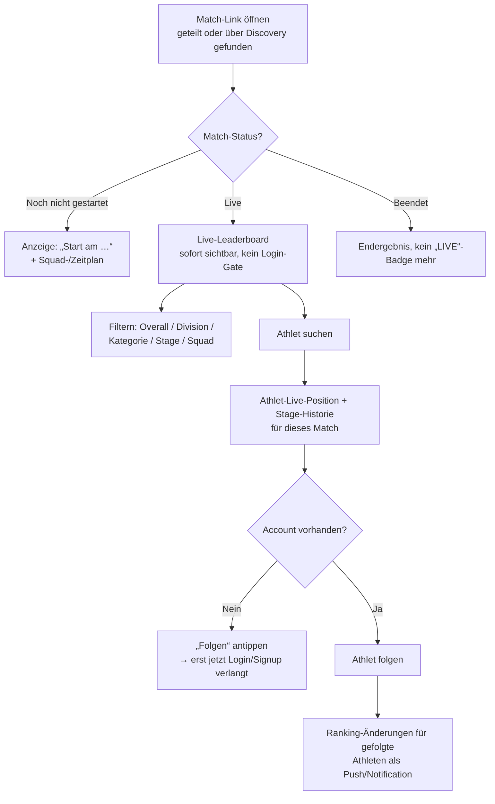

# FORT Competition — Phase 2: Detaillierte User-Flows

Status: Entwurf zur Review. Baut auf [PRODUCT_SPECIFICATION.md](./PRODUCT_SPECIFICATION.md) §6 auf und ergänzt die dort nur als Text skizzierten Flows um vollständige Zustandsdiagramme inkl. Fehler-/Edge-Cases (Registrierung voll, Zahlung fehlgeschlagen, Sync-Konflikt, Score-Korrektur nach Bestätigung — wie in Spec §27 Phase 2 gefordert).

Diagramme sind als Mermaid-Flowcharts geschrieben (rendert nativ auf GitHub). Jeder Flow hat zusätzlich eine Tabelle mit den Edge-Cases, weil ein Flowchart Fehlerpfade zwar zeigen, aber nicht immer den *Grund* für eine Entscheidung transportieren kann.

---

## 1. Athlete-Flow: Entdecken → Registrieren → Wettkampf → Nachbereitung

**Edge-Cases im Detail**

| Situation | Verhalten | Begründung |
|---|---|---|
| Squad voll | Andere Squad wählen oder auf Squad-Warteliste | Verhindert Überbuchung einzelner Squads unabhängig vom Matchlimit |
| Match voll | Match-Warteliste, automatische Benachrichtigung bei Absage eines anderen Athleten | Verhindert verlorene Interessenten; Promotion-Logik liegt beim MD-Flow (§3) |
| Zahlung fehlgeschlagen | Registrierung bleibt `pending_payment`, Slot wird erst nach Ablauf einer Kulanzfrist freigegeben, nicht sofort | Athlet soll nicht durch einen kurzfristigen Zahlungsfehler den Platz verlieren, aber ewig blockierte Plätze sind auch nicht akzeptabel |
| Athlet widerspricht einem Score | Score wird als `needsReview` markiert, **nicht** automatisch akzeptiert oder verworfen | Deckt sich mit dem Event-Sourcing-Prinzip aus Spec §8.1 — nichts wird stillschweigend überschrieben |
| Athlet ohne Internet am Match-Tag | Live-Leaderboard und Personal Dashboard zeigen zuletzt gecachten Stand mit Zeitstempel „zuletzt aktualisiert um…" | Der Athlet ist kein Teil des Scoring-Sync-Pfads (Spec A4), aber die App soll nicht wortlos leer wirken |

---

## 2. Range-Officer-Flow: Der Scoring-Loop

**Edge-Cases im Detail**

| Situation | Verhalten | Begründung |
|---|---|---|
| Komplett offline den ganzen Match-Tag | Loop funktioniert unverändert; Sync-Status-Indikator zeigt „X Events ausstehend" sichtbar, aber ohne den Loop zu unterbrechen | Kernanforderung Spec §7/§9 — Scoring darf nie von Konnektivität abhängen |
| RO tippt sich vertippt, noch vor CONFIRM | Zurück zu Schritt F, freies Editieren | Vor der Bestätigung ist noch kein Event geschrieben, also unkritisch |
| Fehler wird **nach** CONFIRM entdeckt (Shooter schon weg) | Kein freies Nachbearbeiten durch die RO — stattdessen „Korrektur anfordern" → landet in der MD-Review-Queue | Verhindert, dass bestätigte Scores nachträglich durch die falsche Autorität geändert werden; erzwingt Audit-Trail (Spec §9) |
| App/Gerät stürzt mitten in der Erfassung ab | Draft-Zustand ist lokal autosaved (vor CONFIRM), RO setzt an der Stelle fort | Verhindert Datenverlust bei den unzuverlässigsten Geräten im System — Tablets im Freien |
| Zwei Geräte erfassen denselben Shooter/Stage | Kein Auto-Merge, kein Last-Write-Wins — beide Events bleiben, Konflikt wird geflaggt | Direkte Umsetzung von Spec §9.2 (Event Sourcing statt stillem Überschreiben) |
| RO-PIN läuft ab / Schichtwechsel | Neue RO meldet sich mit eigenem PIN am selben Gerät an, vorheriger Loop-Zustand bleibt unberührt | Geräte werden im Tagesverlauf zwischen ROs weitergereicht (Spec §2.4) |

---

## 3. Match-Director-Flow: Match-Aufbau (Wizard) + Live-Betrieb

### 3a. Aufbau (Wizard — bereits in Spec §6.2 als Kette dargestellt, hier als Flow mit Speicherverhalten)

### 3b. Live-Betrieb (der eigentlich wichtige Teil für Phase 2 — die Rolle des MD *während* des Matches)

**Edge-Cases im Detail**

| Situation | Verhalten | Begründung |
|---|---|---|
| Registrierung wird storniert, Warteliste vorhanden | Automatisches Nachrücken + Benachrichtigung, kein manueller Schritt für den MD nötig | Reduziert manuellen Aufwand am Match-Tag, wo der MD am wenigsten Zeit hat |
| Sync-Konflikt | Ergebnis-Publish für die betroffene Stage/Division wird blockiert, bis der Konflikt aufgelöst ist | Verhindert, dass ein unentdeckter Konflikt in ein offizielles, veröffentlichtes Ergebnis einfließt |
| Score-Korrektur nach Bestätigung | Erfolgt **immer** als neues `ScoreEvent` vom Typ `correction`, nie als Überschreiben des bestätigten Events | Direkte Umsetzung „Korrekturen dürfen den Originalscore nie stillschweigend ersetzen" (Spec §9) |
| Zahlungsausfall / No-Show am Match-Tag | Slot wird nach konfigurierbarer Kulanzfrist freigegeben, Athlet bleibt aber in der Historie sichtbar (nicht gelöscht) | Trennung von „Slot-Verfügbarkeit" und „Datenhistorie" — Löschen wäre ein Audit-Verstoß |
| Zwei ROs für dieselbe Squad/Stage eingeteilt | Warnung beim Speichern der Officials-Zuweisung, kein Hard-Block (manche Matches wollen das bewusst) | MD kennt lokale Gepflogenheiten besser als eine starre Systemregel |

---

## 4. Spectator-Flow: Live folgen ohne Account

**Edge-Cases im Detail**

| Situation | Verhalten | Begründung |
|---|---|---|
| Match noch nicht gestartet | Zeitplan-Ansicht statt leerem Leaderboard | Ein leerer Screen wirkt wie ein Fehler, nicht wie „noch nicht so weit" |
| Match beendet | Kein „LIVE"-Badge mehr, Ansicht wird zur normalen Endergebnis-Seite | Vermeidet Verwirrung, ob gerade noch etwas passiert |
| Zuschauer will folgen, hat keinen Account | Login-Gate erscheint **nur** an diesem Punkt, nicht beim reinen Zuschauen | Zentrale Wachstums-Anforderung aus Spec §6.4 — Zuschauen bleibt immer reibungslos |
| Sehr populäres Match (viele gleichzeitige Zuschauer) | Leaderboard wird aus vorab denormalisierten Read-Modellen bedient (Spec §8.2), nicht live pro Request neu berechnet | Skalierungsrisiko aus Spec §13 direkt adressiert |

---

## Offene Punkte für Phase 3 (Datenbankschema)

Diese Flows legen ein paar zusätzliche Zustandsfelder nahe, die im ERD (Phase 3) explizit werden müssen:

- `Registration.status` braucht `pending_payment` als eigenen Zustand (nicht nur pending/waitlisted/confirmed/withdrawn wie in Spec §8 grob skizziert)
- `Score`/`Result` brauchen ein `needsReview`-Flag, das den Publish-Schritt blockieren kann
- `SquadMember` braucht eine eigene Warteliste, unabhängig von der Match-Warteliste (`Registration`-Warteliste betrifft das ganze Match, `SquadMember`-Warteliste nur eine einzelne Squad)
- Ein `WaitlistPromotion`-Audit-Eintrag (wer wurde wann automatisch nachgerückt) für Nachvollziehbarkeit
