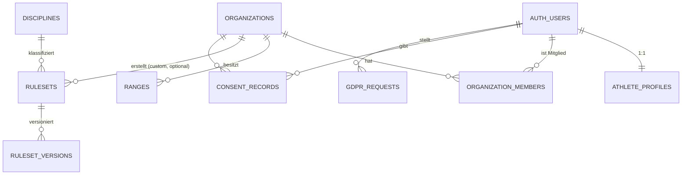
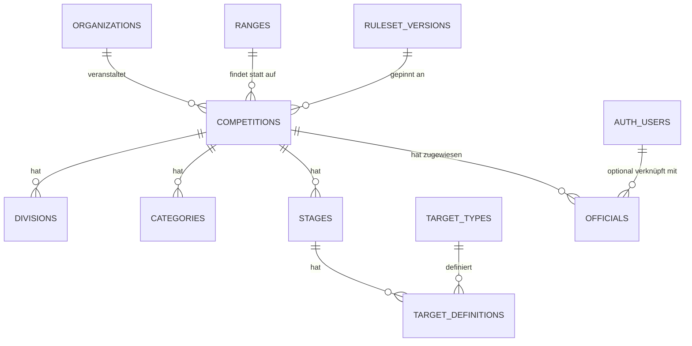
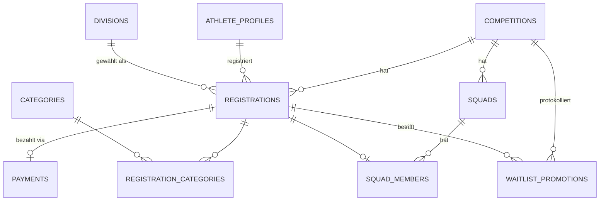
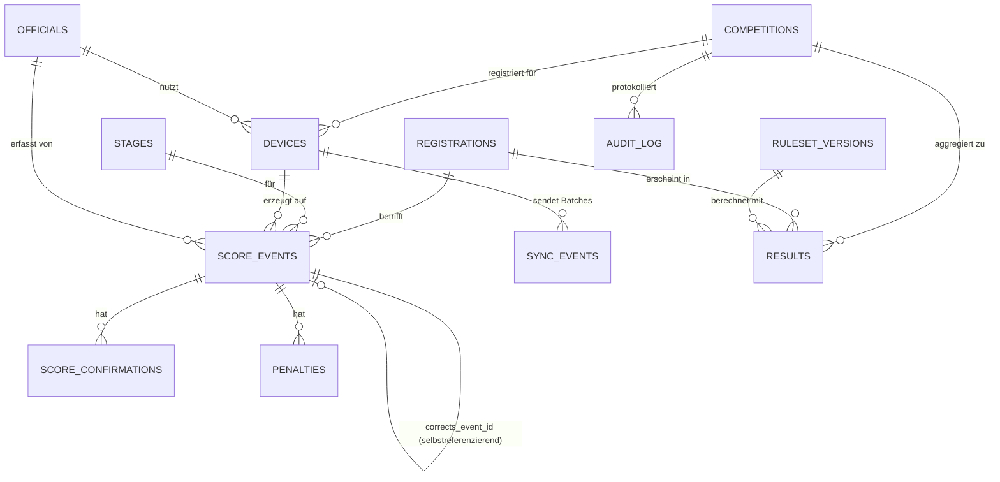

# FORT Competition — Phase 3: Datenbankschema & RLS-Policy-Design

Status: Entwurf zur Review. Konkretisiert das Domain-Modell aus [PRODUCT_SPECIFICATION.md](./PRODUCT_SPECIFICATION.md) §8 zu einem vollständigen ERD und übernimmt die in [PHASE2_USER_FLOWS.md](./PHASE2_USER_FLOWS.md) identifizierten Ergänzungen (`pending_payment`, `needs_review`, Squad-Warteliste, Waitlist-Promotion-Audit).

Zielsystem: PostgreSQL (Supabase), Row-Level Security als durchgesetzte Autorisierungsgrenze (Spec §10.2 — nicht nur Client-seitige Rollenprüfung).

Zwei Änderungen gegenüber dem groben Phase-1-Modell, die sich erst beim Durchdenken der echten Datenstruktur ergeben haben:

1. **Kategorien sind many-to-many, nicht 1:N.** Ein Schütze kann gleichzeitig „Lady" **und** „Senior" sein — das sind unabhängige Achsen, keine exklusive Auswahl. Phase 1 hatte vereinfacht `Registration N—1 Category` skizziert; hier wird daraus `registration_categories` als Join-Tabelle.
2. **Score-Korrekturen mutieren nie eine Zeile, auch nicht ein Bookkeeping-Feld.** Statt eines `superseded_by`-Zeigers, der nachträglich auf dem Original-Event gesetzt würde (= eine Mutation, und sei sie noch so klein), verweist eine Korrektur über `corrects_event_id` **vom neuen Event auf das alte**. Der aktuell gültige Score ist eine reine Funktion über den Event-Log, nie ein geschriebenes Feld. Das ist die konsequente Zu-Ende-Führung des in Spec §8.1/§9.2 begründeten Event-Sourcing-Ansatzes.

---

## 1. ERD — Fundament: Identität, Organisation, Ranges, Regelwerk



## 2. ERD — Match-Aufbau (Match Builder)



## 3. ERD — Registrierung, Squadding, Zahlung



## 4. ERD — Scoring, Sync, Ergebnisse, Audit



---

## 5. Tabellenreferenz

Legende: **PK** Primärschlüssel · **FK** Fremdschlüssel · *cache* = abgeleiteter, neu berechenbarer Wert (Spec §8.2 — bewusste Ausnahme von „keine doppelten abgeleiteten Werte", dokumentiert statt versteckt)

### 5.1 Identität & Organisation

| Tabelle | Spalten (Auswahl) | Hinweise |
|---|---|---|
| `athlete_profiles` | `id` PK (=`auth.users.id`), `display_name`, `country`, `locale`, `avatar_url`, `matches_count` *cache*, `stages_count` *cache*, `podiums_count` *cache*, `wins_count` *cache*, `avg_match_pct` *cache*, `avg_stage_pct` *cache*, `avg_hit_factor` *cache*, `a_zone_pct` *cache*, `penalty_rate` *cache*, `dnf_rate` *cache*, `created_at` | Cache-Felder werden per Job nach jedem `PUBLISH RESULTS` neu berechnet, nie direkt geschrieben |
| `organizations` | `id` PK, `name`, `country`, `description`, `logo_url`, `created_at` | |
| `organization_members` | `id` PK, `organization_id` FK, `user_id` FK, `role` (`owner`\|`admin`\|`member`), `created_at` | `UNIQUE(organization_id, user_id)` |
| `ranges` | `id` PK, `organization_id` FK, `name`, `address`, `gps_lat`, `gps_lng`, `timezone`, `bays` nullable, `facilities` jsonb, `created_at` | |
| `consent_records` | `id` PK, `user_id` FK, `type` (`terms`\|`privacy`\|`marketing`), `version`, `granted_at` | append-only, nie gelöscht |
| `gdpr_requests` | `id` PK, `user_id` FK, `type` (`export`\|`delete`), `status`, `requested_at`, `completed_at` | macht GDPR-Selfservice auditierbar (Spec §16) |

### 5.2 Regelwerk (Rules Engine)

| Tabelle | Spalten (Auswahl) | Hinweise |
|---|---|---|
| `disciplines` | `id` PK, `code` unique, `name` | z. B. `ipsc_handgun`, `custom` |
| `rulesets` | `id` PK, `discipline_id` FK, `organization_id` FK **nullable**, `name`, `scoring_type` | `organization_id = null` → offizielles/globales Ruleset (IPSC); gesetzt → Club-eigenes Ruleset aus dem Custom Match Builder — **gleicher Tabellentyp, kein Sonderpfad** (Spec §7.3) |
| `ruleset_versions` | `id` PK, `ruleset_id` FK, `version` (semver), `status` (`draft`\|`published`\|`deprecated`), `definition` jsonb, `published_at`, `created_at` | `definition` enthält Divisions/Kategorien/Target-Typen/Strafen/Validierungsregeln/Kalkulator-Konfiguration. **Trigger verbietet UPDATE auf `definition`, sobald `status='published'`** — einzig erlaubter Übergang ist `draft → published`, danach nur noch `published → deprecated` |
| `target_types` | `id` PK, `code`, `name`, `zones` jsonb | Referenztabelle, wiederverwendbar über Rulesets hinweg (z. B. IPSC-Metric-Target für Handgun *und* PCC) |

### 5.3 Match-Konfiguration

| Tabelle | Spalten (Auswahl) | Hinweise |
|---|---|---|
| `competitions` | `id` PK, `organization_id` FK, `range_id` FK, `ruleset_version_id` FK, `name`, `level`, `starts_at`, `ends_at`, `timezone`, `status` (`draft`\|`published`\|`registration_open`\|`registration_closed`\|`in_progress`\|`completed`\|`archived`), `visibility` (`public`\|`unlisted`\|`private`), `currency`, `created_at` | `ruleset_version_id` wird beim Publish fixiert und **nie mehr geändert** (Spec §7.2 — historische Matches behalten ihre Ruleset-Version) |
| `divisions` | `id` PK, `competition_id` FK, `code`, `name`, `config` jsonb | ggf. Einschränkung der im Ruleset verfügbaren Divisionen durch den MD |
| `categories` | `id` PK, `competition_id` FK, `code`, `name` | z. B. Lady, Senior, Super-Senior, Junior — überlappend, siehe §5.4 |
| `stages` | `id` PK, `competition_id` FK, `number`, `name`, `description`, `max_points` nullable, `par_time` nullable, `published` bool | |
| `target_definitions` | `id` PK, `stage_id` FK, `label` (T1, T2…), `target_type_id` FK, `required_hits` | |
| `officials` | `id` PK, `competition_id` FK, `user_id` FK **nullable**, `device_scoped_code_hash` nullable, `role` (`match_director`\|`range_master`\|`cro`\|`ro`\|`scorekeeper`\|`stats_officer`\|`admin`), `squad_scope` uuid[] nullable, `created_at` | `user_id = null` + `device_scoped_code_hash` gesetzt = tagesbasierte RO-Anmeldung ohne volles Konto (Spec §2.4) |

### 5.4 Registrierung, Squadding, Zahlung

| Tabelle | Spalten (Auswahl) | Hinweise |
|---|---|---|
| `registrations` | `id` PK, `competition_id` FK, `athlete_profile_id` FK, `division_id` FK, `status` (`pending_payment`\|`pending_approval`\|`waitlisted`\|`confirmed`\|`withdrawn`\|`no_show`), `waitlist_position` nullable, `registered_at` | `UNIQUE(competition_id, athlete_profile_id)`; `pending_payment` und der Waitlist-Zustand wurden in Phase 2 als fehlende Zustände identifiziert |
| `registration_categories` | `registration_id` FK, `category_id` FK | Join-Tabelle statt 1:N — ein Schütze kann mehreren Kategorien gleichzeitig angehören |
| `payments` | `id` PK, `registration_id` FK, `amount`, `currency`, `vat_amount`, `vat_rate`, `provider` (`stripe`), `provider_ref`, `status` (`pending`\|`succeeded`\|`failed`\|`refunded`), `created_at` | Schreibzugriff **ausschließlich** über Server-seitigen Stripe-Webhook-Handler, nie direkt vom Client (siehe RLS §6) |
| `squads` | `id` PK, `competition_id` FK, `name`, `capacity`, `scheduled_start` nullable, `range_bay` nullable | |
| `squad_members` | `id` PK, `squad_id` FK, `registration_id` FK, `status` (`confirmed`\|`waitlisted`), `joined_at` | `UNIQUE(registration_id)` — ein Athlet ist pro Competition genau einer Squad zugeordnet; **Squad-eigene Warteliste**, unabhängig von der Match-Warteliste (Phase-2-Erkenntnis) |
| `waitlist_promotions` | `id` PK, `competition_id` FK, `registration_id` FK, `from_status`, `to_status`, `triggered_by` (`withdrawal`\|`manual`), `promoted_at` | Audit-Trail für automatisches Nachrücken (Phase-2-Erkenntnis) |

### 5.5 Scoring, Sync, Ergebnisse, Audit

| Tabelle | Spalten (Auswahl) | Hinweise |
|---|---|---|
| `devices` | `id` PK, `competition_id` FK, `official_id` FK nullable, `label`, `last_seen_at`, `created_at` | |
| `score_events` | `id` PK (**client-generiertes UUID**, nicht server-vergeben), `competition_id` FK, `registration_id` FK, `stage_id` FK, `device_id` FK, `official_id` FK, `event_type` (`score_entered`\|`score_corrected`\|`score_confirmed`\|`score_flagged`), `payload` jsonb (Treffer pro Ziel, Zeit, Strafen), `corrects_event_id` FK **nullable, selbstreferenzierend**, `client_created_at`, `server_received_at` default `now()`, `sequence` bigserial | **Nur INSERT, nie UPDATE/DELETE** (per RLS + Trigger erzwungen). `id` ist client-generiert, weil das Gerät beim Schreiben offline ist und keine server-vergebene ID kennen kann |
| `score_confirmations` | `id` PK, `score_event_id` FK, `method` (`pin`\|`signature`\|`qr`\|`button`), `confirmed_by_registration_id` FK nullable, `confirmed_at`, `signature_data` nullable | |
| `penalties` | `id` PK, `score_event_id` FK, `penalty_type`, `quantity`, `value` | Normalisiert statt nur im `payload` jsonb versteckt — wird für Analytics (Penalty-Rate, Spec §12) direkt abgefragt |
| `sync_events` | `id` PK, `device_id` FK, `batch_id`, `event_count`, `status` (`uploaded`\|`processed`\|`conflict`), `received_at` | Beobachtbarkeit des Sync-Vorgangs selbst, getrennt vom fachlichen `score_events`-Log |
| `results` | `id` PK, `competition_id` FK, `scope` (`overall`\|`division`\|`category`\|`stage`\|`squad`), `scope_ref_id` nullable, `registration_id` FK, `rank`, `points`, `percentage`, `hit_factor` nullable, `needs_review` bool default false, `ruleset_version_id` FK, `calculated_at` | *cache* — vollständig aus `score_events` + `RulesetVersion.rankingCalculation()` neu berechenbar; `needs_review=true` blockiert den Publish-Schritt (Phase-2-Erkenntnis). `UNIQUE(competition_id, scope, scope_ref_id, registration_id)` |
| `audit_log` | `id` PK, `actor_user_id` FK nullable, `actor_official_id` FK nullable, `action`, `entity_type`, `entity_id`, `before` jsonb, `after` jsonb, `device_id` FK nullable, `created_at` | Append-only; erfasst **alle** mutierenden Aktionen, nicht nur Scoring (Spec §10.1) |

---

## 6. RLS-Policy-Design

Grundprinzip (Spec §10.2): **die Datenbank ist die Autorisierungsgrenze, nicht die API.** Jede Tabelle unten bekommt eine RLS-Policy, die unabhängig von der Anwendungsschicht gilt.

| Tabelle / Gruppe | SELECT | INSERT / UPDATE | DELETE |
|---|---|---|---|
| `organizations`, `ranges` | öffentlich lesbar (Discovery, Match-Seiten brauchen Range-Infos) | nur `organization_members.role IN ('owner','admin')` der jeweiligen Organisation | nie (Soft-Delete/Archivierung statt Hard-Delete) |
| `organization_members` | Mitglieder der eigenen Organisation + der betroffene User selbst | nur `owner`/`admin` derselben Organisation | nur `owner` |
| `rulesets`, `ruleset_versions` | öffentliche (`organization_id IS NULL`) immer lesbar; Club-eigene nur für Org-Mitglieder, bis `status='published'` — dann öffentlich (andere Clubs sollen fremde veröffentlichte Custom-Rulesets sehen und übernehmen können) | nur Org-`admin`/`owner`; **UPDATE auf `definition` blockiert sobald `status='published'`** (DB-Trigger, nicht nur Policy) | nie |
| `competitions` | `visibility='public'` und `status NOT IN ('draft')` → jeder (auch anonym); `draft`/`private` nur für zugewiesene `officials` bzw. Org-Mitglieder | nur `officials.role IN ('match_director','admin')` für diese Competition | nie (nur `status='archived'`) |
| `divisions`, `categories`, `stages`, `target_definitions` | wie übergeordnete `competitions`-Sichtbarkeit; unpublizierte Stages (`published=false`) nur für Match-Staff (verhindert Stage-Design-Leaks vor dem Match) | nur `match_director`/`admin` dieser Competition | nur `match_director`/`admin`, nur vor `status='in_progress'` |
| `officials` | Match-Staff der Competition + der/die betroffene User selbst | nur `match_director`/`admin` | nur `match_director`/`admin` |
| `registrations` | der eigene Athlet (`athlete_profile_id = auth.uid()`) + Match-Staff dieser Competition | INSERT durch den Athleten selbst (eigene Registrierung); Status-Änderungen (`confirmed`→`withdrawn` etc.) durch Athlet (nur eigene) oder Match-Staff | nie (nur `status='withdrawn'`) |
| `registration_categories`, `squad_members` | wie `registrations` | Athlet für eigene Registrierung (Squad-Wahl), Match-Staff für alle | Athlet für eigene (Squad verlassen), Match-Staff für alle |
| `payments` | der eigene Athlet + `match_director`/`admin` dieser Competition (keine Kartendaten, nur Status/Betrag) | **ausschließlich Service-Role** (Stripe-Webhook-Handler) — kein Client, auch kein Match Director, schreibt direkt in `payments` | nie |
| `devices` | Match-Staff der Competition | Anlage bei RO-Login (Service-Role oder `official`-Session) | nie |
| `score_events` | Match-Staff der Competition; Athlet sieht **nur eigene** (`registration_id` gehört ihm) | **INSERT-only**, nur durch `officials.role IN ('ro','cro','scorekeeper')` **mit Zuweisung zur betroffenen Squad** (`squad_scope`); **UPDATE/DELETE für niemanden möglich**, auch nicht für `match_director` (Trigger erzwingt Immutability) | nie, kategorisch |
| `score_confirmations` | wie `score_events` | INSERT durch den bestätigenden Official oder den Athleten selbst (Self-Service-Bestätigung) | nie |
| `penalties` | wie `score_events` | wie `score_events` (gemeinsam mit dem zugehörigen Event geschrieben) | nie |
| `results` | öffentlich, sobald `competitions.status` live/veröffentlicht ist (das ist die Live-Leaderboard-Anforderung aus Spec §10) | nur durch den Recompute-Service (Service-Role), niemals durch Client-Writes | nie (nur Neuberechnung überschreibt den Cache) |
| `audit_log` | nur Org-`owner`/`admin` für ihre Organisation, `match_director` für ihre Competition, Platform Admin für alles | nur Service-Role (wird von Triggern/Backend geschrieben, nie direkt vom Client) | nie |
| `athlete_profiles` | öffentliches Subset (Name, Land, Division, Statistiken) für alle; volle Zeile nur für den Owner | nur der Owner (eigenes Profil) | nur Owner (→ triggert GDPR-Löschprozess, kein direktes Hard-Delete der Historie, siehe unten) |
| `consent_records`, `gdpr_requests` | nur der eigene User + Platform Admin | INSERT durch den User selbst | nie |

**Beispielhafte Policy-Formulierung** (illustrativ, keine vollständige DDL — das ist Phase 4/7-Implementierungsarbeit):

```sql
-- score_events: reine Insert-Berechtigung, strikt an Squad-Zuweisung gebunden
create policy "ro_can_insert_assigned_squad_scores"
on score_events for insert
with check (
  exists (
    select 1 from officials o
    where o.id = auth.official_id()          -- aus dem RO-Session-Claim
      and o.competition_id = score_events.competition_id
      and o.role in ('ro', 'cro', 'scorekeeper')
      and score_events.stage_id in (
        select s.id from stages s
        join squad_members sm on sm.registration_id = score_events.registration_id
        where sm.squad_id = any(o.squad_scope)
      )
  )
);

-- score_events: UPDATE/DELETE kategorisch verboten — kein Policy erlaubt es,
-- zusätzlich per REVOKE gegen jede Rolle abgesichert:
revoke update, delete on score_events from authenticated, anon;

-- results: öffentlich lesbar, sobald das Match live/veröffentlicht ist
create policy "public_can_read_live_results"
on results for select
using (
  exists (
    select 1 from competitions c
    where c.id = results.competition_id
      and c.visibility = 'public'
      and c.status in ('in_progress', 'completed')
  )
);
```

### 6.1 Warum `score_events` per `REVOKE`, nicht nur per fehlender Policy, abgesichert wird

Eine fehlende UPDATE/DELETE-Policy in Postgres RLS bedeutet implizit „niemand darf" — das würde technisch reichen. Der explizite `REVOKE` ist trotzdem sinnvoll dokumentiert: er macht die Unveränderlichkeit **für jeden, der später das Schema liest, sofort sichtbar**, statt sich auf „es gibt zufällig keine Policy dafür" zu verlassen. Bei der wichtigsten Integritätsgarantie des ganzen Systems (Spec §7: „ein Score darf nie stillschweigend verschwinden oder überschrieben werden") soll das nicht implizit, sondern explizit im Schema stehen.

### 6.2 Warum `athlete_profiles`-Löschung nicht einfach `DELETE` auslöst

GDPR verlangt Löschbarkeit, aber `registrations`/`score_events` sind Teil der **Wettkampf-Historie anderer Personen** (Ranglisten, Ergebnislisten) — die dürfen durch die Löschung eines einzelnen Athleten nicht korrumpiert werden. Der `gdpr_requests`-Eintrag vom Typ `delete` triggert stattdessen einen Service-Prozess, der personenbezogene Felder in `athlete_profiles` anonymisiert (Name → „Gelöschter Nutzer", E-Mail entfernt) und historische Score-/Ergebniszeilen **strukturell erhält, aber entpersonalisiert** — Ranglisten bleiben korrekt, die Person ist nicht mehr identifizierbar.

---

## 7. Offene Punkte für Phase 4 (Applikationsarchitektur)

- Exaktes Format von `ruleset_versions.definition` (jsonb) — Phase 4 sollte hierfür ein TypeScript-Schema (Zod o. ä.) definieren, das sowohl beim Schreiben (Match Builder) als auch beim Lesen (Rules-Engine-Package, Spec §7.4) validiert.
- `officials.device_scoped_code_hash` — genaues Hashing-/Rotations-/Ablaufverfahren für tagesbasierte RO-PINs ist Sicherheitsdetail, nicht Schema-Detail; gehört in die Auth-Architektur von Phase 4.
- Recompute-Service für `results`: wird als eigener, klar abgegrenzter Service-Prozess behandelt (kein Client-Write, siehe RLS-Tabelle) — seine Trigger-Bedingungen (nach jedem `score_confirmed`-Event? nur auf Anfrage? beides?) werden in Phase 4 festgelegt.
- Indexierung/Performance (insb. `score_events` bei sehr großen Matches, `results` für Live-Leaderboard-Reads) ist bewusst nicht Teil dieses Schema-Entwurfs — das ist Optimierungsarbeit auf einem stehenden Schema, nicht Architektur.
- ~~**`athlete_profiles.id = auth.users.id` (§5.1) noch einmal bewusst prüfen, bevor das echte Schema steht.**~~ **→ Entschieden (Phase 7, Migration `20260813120000_foundation.sql`): entkoppelt.** Statt `athlete_profiles` mit `id = auth.users.id` gibt es eine `shooters`-Entität mit **nullable `user_id`** — dasselbe Muster, das `officials.user_id` bereits nutzt. Begründung: die harte 1:1-Kopplung hätte drei Dinge strukturell unmöglich gemacht, die für das Produkt zentral sind: (1) Import bestehender Ergebnisse aus Fremdsystemen, (2) Walk-up-Registrierung durch den Match Director am Matchtag, (3) „Profil beanspruchen" ([ROADMAP_EXTENSIONS.md](./ROADMAP_EXTENSIONS.md) Punkt 4). Ein Schütze ist damit die fachliche Person, ein Account eine optionale Ergänzung. Preis: ein zusätzlicher Join, wo vorher `auth.uid()` direkt gereicht hätte — dafür gibt es `auth_shooter_id()` als RLS-Hilfsfunktion. Die abgeleiteten Statistiken liegen zusätzlich in einer eigenen Tabelle `shooter_stats` statt als Spalten auf dem Profil, weil sie einen anderen Lebenszyklus haben (Recompute-Job schreibt, Nutzer nie).
